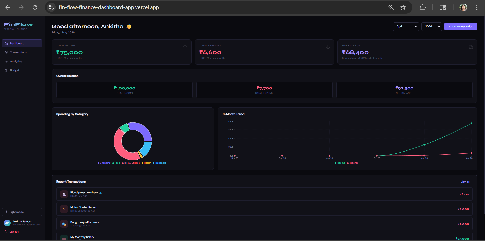
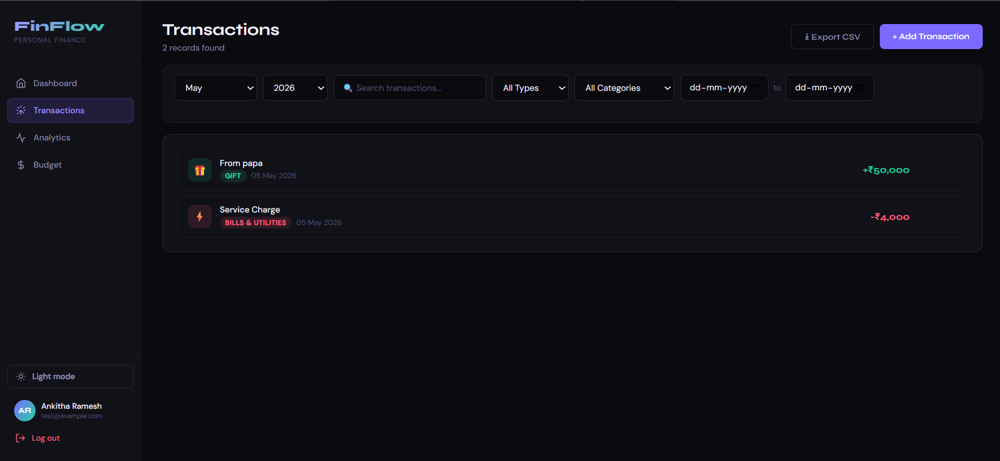
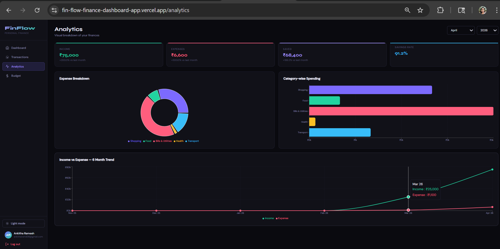
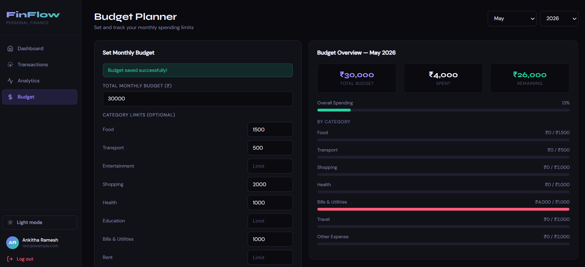

# FinFlow — MERN Personal Finance Dashboard

Portfolio-ready, full-stack finance dashboard to track transactions, budgets, and trends with a polished production UX.



🚀 **[Live Demo → Open FinFlow Dashboard](https://fin-flow-finance-dashboard-app.vercel.app/)**

🧪 Test Credentials:
- Email: test@example.com
- Password: 123456

**Author:** Ankitha Ramesh

## Tech Stack

- **Frontend:** React (Vite), React Router, Axios, Recharts
- **Backend:** Node.js, Express.js, JWT (jsonwebtoken), bcryptjs
- **Database:** MongoDB Atlas, Mongoose
- **UI/UX:** Tailwind-inspired dark UI (CSS variables), Dark/Light mode toggle, `react-hot-toast`

## Features

- **JWT Authentication**
  - Signup / login, protected routes, persistent sessions
- **Transactions**
  - Add, edit, delete income/expense transactions
  - Filters: **type**, **category**, **date range**, **search**
  - Export filtered results to **CSV** (frontend-only)
- **Recurring Monthly Transactions (Key Feature)**
  - Mark a transaction as **recurring (monthly)**
  - On fetch, the backend **auto-generates missing entries for the current month without duplication**
- **Dashboard**
  - Balance, total income/expense summary
  - Recent transactions
  - Month & year filtering
  - Simple financial insights (month-over-month change + savings trend)
- **Analytics**
  - Category charts + monthly trend charts
  - Month & year filtering
  - Month-over-month insights
- **Budget Planner**
  - Set monthly budget + optional category budgets
  - Alerts when nearing / exceeding budget
- **Production UX Enhancements**
  - Toast notifications (success/error)
  - Loading states (with anti-flicker delay)
  - Empty states with icon + CTA
  - Dark/Light mode toggle (stored in localStorage with smooth transitions)

## Folder Structure

```
finance-dashboard/
├── client/                        # React frontend (Vite)
│   ├── src/
│   │   ├── components/
│   │   │   ├── Layout.jsx
│   │   │   ├── TransactionModal.jsx
│   │   │   ├── Loader.jsx
│   │   │   ├── EmptyState.jsx
│   │   │   └── MonthYearPicker.jsx
│   │   ├── context/
│   │   │   ├── AuthContext.jsx
│   │   │   └── ThemeContext.jsx
│   │   ├── pages/
│   │   │   ├── AuthPage.jsx
│   │   │   ├── DashboardPage.jsx
│   │   │   ├── TransactionsPage.jsx
│   │   │   ├── AnalyticsPage.jsx
│   │   │   └── BudgetPage.jsx
│   │   ├── utils/
│   │   │   ├── api.js
│   │   │   ├── helpers.js
│   │   │   └── csv.js
│   │   ├── App.jsx
│   │   ├── main.jsx
│   │   └── index.css
│   ├── package.json
│   └── vite.config.js
├── server/                        # Node.js + Express backend
│   ├── middleware/
│   │   └── auth.js                # JWT verification
│   ├── models/
│   │   ├── User.js
│   │   ├── Transaction.js         # Includes recurring fields
│   │   └── Budget.js
│   ├── routes/
│   │   ├── auth.js
│   │   ├── transactions.js        # Filters + recurring auto-generation
│   │   └── budgets.js
│   ├── index.js                   # Server entry
│   └── package.json
├── render.yaml
└── package.json
```
## 📸 Screenshots

### Dashboard


### Transactions


### Analytics


### Budget Limit


## Installation

### Prerequisites

- Node.js (LTS recommended)
- MongoDB Atlas cluster (or any MongoDB connection string)

### Setup

```bash
git clone <your-repo-url>
cd finance-dashboard

cd server
npm install

cd ../client
npm install
```

## Environment Variables

### `server/.env`

Create `server/.env` (you can copy from `server/.env.example` if present):

```env
MONGO_URI=your_mongodb_connection_string
JWT_SECRET=your_strong_secret
PORT=5000
CLIENT_URL=http://localhost:5173
```

- **MONGO_URI**: MongoDB Atlas connection string
- **JWT_SECRET**: secret used to sign/verify JWTs
- **PORT**: backend port (default `5000`)
- **CLIENT_URL**: frontend URL for CORS (local: `http://localhost:5173`)

### `client/.env`

Create `client/.env`:

```env
VITE_API_URL=http://localhost:5000/api
```

- **VITE_API_URL**: backend base URL (Vite env var)

## Run Locally

### Backend

```bash
cd server
npm run dev
```

Backend runs on `http://localhost:5000`

### Frontend

```bash
cd client
npm run dev
```

Frontend runs on `http://localhost:5173`

## Future Improvements (Optional)

- Recurring rules beyond monthly (weekly/quarterly) + “end date”
- Pagination + server-side sorting on transactions list
- Attachments/receipts per transaction (file upload)
- Multi-currency settings + exchange-rate insights
- E2E tests (Playwright/Cypress) and CI pipeline
